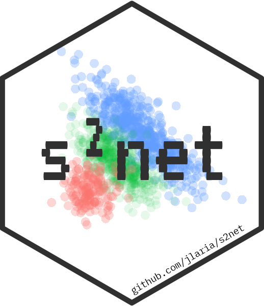

```{r setup, include=FALSE}
knitr::opts_chunk$set(echo = TRUE)
```

### Overview 

This repository contains the source code of the simulations and real data analyses showcased in the paper *A generalized elastic-net for semi-supervised learning of sparse features*.

The implementation in [`s2net`](https://github.com/jlaria/s2net) is compared with other approaches for semi-supervised learning. The simulations are coded using [`p4R`](https://github.com/jlaria/p4R), an R package that helps building with parallel simulations with a template for RStudio. Specifically, these simulations were run on an LSF cluster. 